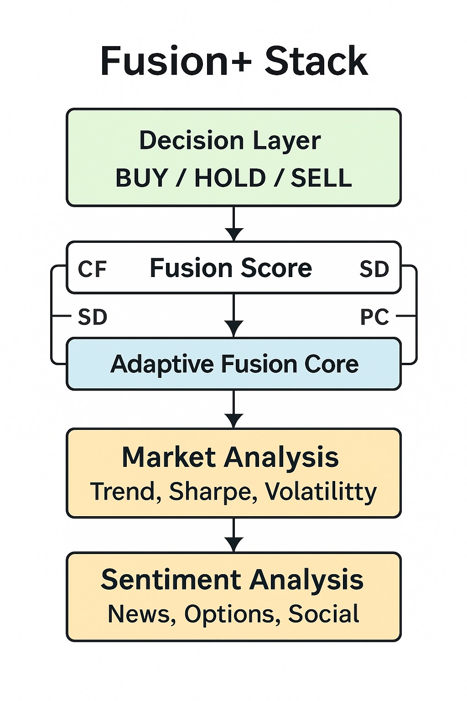
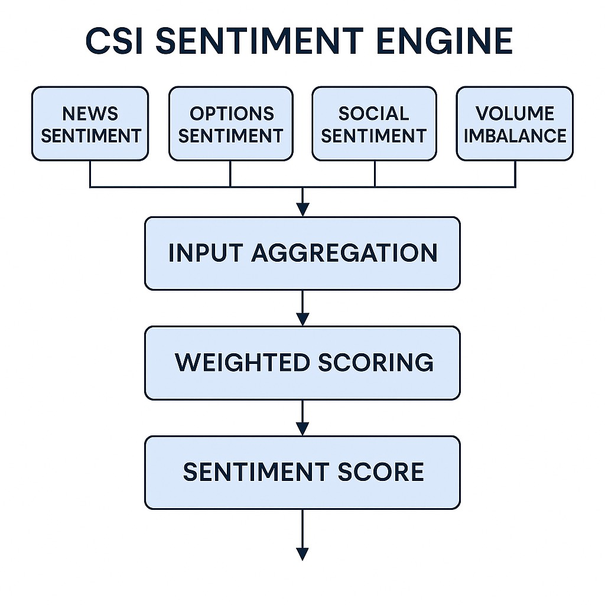
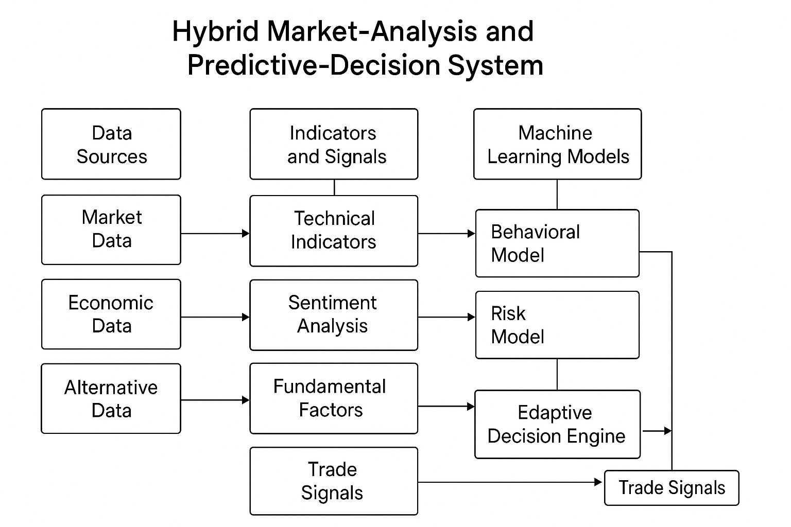

# Ronlee Market System v2.5 — Fusion+ Framework  
### *Predictive Market-Analysis & Adaptive Decision Engine (Academic Edition)*


---

## 📘 Overview  
The **Ronlee Market System v2.5 (Fusion+ Framework)** is a hybrid market-analysis and predictive-decision model integrating:

- ⭐ Technical indicators  
- ⭐ Relative strength modeling  
- ⭐ Sharpe-adjusted trend validation  
- ⭐ Behavioral sentiment analytics (CSI v2)  
- ⭐ Adaptive predictive feedback (PC Layer)  
- ⭐ Cloudflare Worker backend  
- ⭐ Python fusion engine  
- ⭐ Google Sheets automation pipeline  

This version is the **public academic release** for research and educational purposes only.  
It is not financial advice and should not be used for trading decisions.  
Commercial use is prohibited (see license).

---

## 🎯 Mission Statement  
*The Ronlee Market System exists to push the boundary of what’s possible in market prediction. While perfect foresight may be unattainable, the pursuit itself reveals critical insights into market behavior, economic dynamics, and human decision-making. By exploring the limits of predictive modeling, we aim to deepen our understanding of uncertainty, enhance data-driven reasoning, and contribute meaningful perspectives to the future of financial analytics.*

---

## 🔬 Research Questions  
The Fusion+ Framework is guided by core questions that deepen its development:

### **Market Structure & Predictive Limits**
- What structural patterns consistently emerge across market regimes?  
- Are there universal behaviors in trend formation or volatility bursts?  
- To what extent can multi-layered indicators reduce uncertainty without overfitting?

### **Behavioral Economics & Sentiment**
- How does aggregated sentiment influence short- and medium-term price behavior?  
- Can sentiment signals be quantified in a way that materially improves model accuracy?  
- What are the limits of sentiment-based modeling in irrational markets?

### **Nonlinear Dynamics & Feedback**
- How do feedback loops amplify or suppress price movement?  
- Can adaptive weighting improve predictive stability across volatile conditions?  
- Is it possible to detect structural changes in a trend before they are obvious?

### **Model Robustness & Resilience**
- How does the model perform in high-uncertainty vs. stable cycles?  
- Can a model remain interpretable while still being adaptive?  
- What elements of predictive accuracy come from structure vs. randomness?

### **Human Behavior & Market Psychology**
- How do human biases manifest in patterns, sentiment spikes, and reversals?  
- Which signals consistently reflect fear, greed, hesitation, or overconfidence?  
- How can modeling human tendencies improve understanding of price movement?

---

## 🧠 Extended Philosophy  
The Ronlee Market System is built on a paradox:  
**Perfect prediction may be impossible — but the pursuit reveals deeper truths.**

Markets sit at the intersection of:
- human psychology  
- economic structure  
- information flow  
- randomness  
- collective behavior  

By striving toward an ideal that cannot be reached, we gain insight into:

### **1. The Nature of Uncertainty**  
Financial markets evolve through a blend of signal and noise.  
Studying prediction teaches us where that boundary truly lies.

### **2. The Limits of Rational Models**  
Classical models assume rational actors.  
Real markets are emotional, chaotic, asymmetrical.  
Fusion+ attempts to bridge rational modeling with behavioral reality.

### **3. The Structure of Market Movement**  
Price appears random, yet patterns emerge:
- momentum  
- exhaustion  
- structure shifts  
- cyclical rhythm  

These movements reveal the “physics” of market behavior.

### **4. Human Behavior Reflected in Markets**  
Price action mirrors:
- confidence  
- fear  
- greed  
- uncertainty  

Understanding markets means understanding people.

### **5. The Value of an Impossible Goal**  
The pursuit of perfect prediction pushes innovation:
- better indicators  
- deeper sentiment layers  
- improved weighting systems  
- adaptive logic  
- refined data flow  

Even if perfection is unreachable, the *process* expands our understanding of complexity.

### **6. Core Philosophy**  
**We do not seek to eliminate uncertainty — only to illuminate it.**  
Prediction becomes a framework for insight, not a promise of certainty.

---

# 📊 Core Architecture

### 🧩 Fusion+ Stack Diagram  


### 🧠 CSI v2 — Sentiment Engine  


### 🧩 Architecture Diagram  


### 🔄 Market-Decision Data Pipeline  


---

# 📚 Documentation  

All documentation is located in the `/docs` folder.

| Document | Description |
|----------|-------------|
| **architecture.md** | System architecture overview |
| **formulas.md** | Mathematical formulas for CF, DSG, SD, PC |
| **methodology.md** | Research methodology behind Fusion+ |
| **model_layers.md** | Layer-by-layer breakdown |
| **how_to_read_diagrams.md** | Guide for understanding all diagrams |
| **assets/** | Architecture, Fusion+, CSI, and pipeline diagrams |

---

# ⚙️ Quick Start  

## 1. Python Fusion Engine  
Located in `/src`.

Run locally:

```bash
python fusion_score.py
```

---

## 💡 Version Philosophy  
This academic edition demonstrates the research foundation and theoretical model design, while the private full version contains proprietary enhancements, real-time logic, and advanced decision modules not suitable for public release.

---

## 📝 License  
Licensed under **CC BY-NC-SA 4.0**.  
No commercial use.  
Attribution required.  
Adaptations must share alike.

---
